# Pertemuan 2 Praktikum Algoritma dan Struktur Data
  

Nama : AHMAD DZUL FADHLI HANNAN  
Nomor : 03  
Kelas : TI1H  
NIM : 2341720106

## 1. Tujuan Praktikum
1. Mengenal objek dan class sebagai konsep mendasar pada pemrograman berorientasi objek
2. Mendeklarasikan class, atribut dan method
3. Membuat objek (instansiasi)
4. Mengakses atribut dan method dari suatu objek
5. Menerapkan konstruktor

## 2. Praktikum
### 2.1 Percobaan 1: Deklarasi Class, Atribut dan Method
#### 2.1.1 Langkah-langkah
#### 2.1.2 Verifikasi Hasil Percobaan
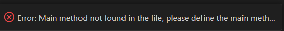

#### 2.1.3 Pertanyaan
1. Sebutkan dua karakteristik class atau object!
Jawaban :  Mempunyai nilai (variabel/ atribut) dan melakukan sesuatu (method/ fungsi)
2. Perhatikan class Buku pada Praktikum 1 tersebut, ada berapa atribut yang dimiliki oleh class Buku? Sebutkan apa saja atributnya!
Jawaban : Terdapat 5 atribut, anatarnya judul, pengarang, halaman, stok, dan harga.
3. Ada berapa method yang dimiliki oleh class tersebut? Sebutkan apa saja methodnya!
Jawaban : Terdapat 4 method, antaranya tampilan, terjual, restok, dan gantiHarga
4. Perhatikan method terjual() yang terdapat di dalam class Buku. Modifikasi isi method tersebut sehingga proses pengurangan hanya dapat dilakukan jika stok masih ada (lebih besar dari 0)!
Jawaban : 
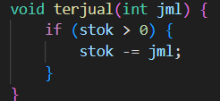

5. Menurut Anda, mengapa method restock() mempunyai satu parameter berupa bilangan int?
Jawaban : Karena dalam method terdapat objek stok yang memiliki tipe data yang sama dengan jml yaitu int.
6. Commit dan push kode program ke Github

### 2.2 Percobaan 2: Instansiasi Object, serta Mengakses Atribut dan Method
#### 2.2.1 Langkah-langkah
#### 2.2.2 Verifikasi Hasil Percobaan
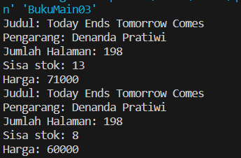

#### 2.2.3 Pertanyaan
1. Pada class BukuMain, tunjukkan baris kode program yang digunakan untuk proses instansiasi! Apa nama object yang dihasilkan?
Jawaban : Buku03 bk1 = new Buku03();. Dengan nama objek bk1.
2. Bagaimana cara mengakses atribut dan method dari suatu objek?
Jawaban : dengan memanggil nama objek diikuti tanda titik kemudian nama atribut dan method. Contoh objek.atribut. Setelahnya menyesuaikan yang diakses atribut atau method.
3. Mengapa hasil output pemanggilan method tampilInformasi() pertama dan kedua berbeda?
Jawaban : tampilInformasi() pertama adalah deklarasi atribut saja, sedangkan tampilInformasi() kedua menampilkan atribut setelah di operasikan oleh method terjual dengan parameter 5, dan gantiHarga yang parameternya 60000.

### 2.3 Percobaan 3: Membuat Konstruktor
#### 2.3.1 Langkah-langkah
#### 2.3.2 Verifikasi Hasil Percobaan
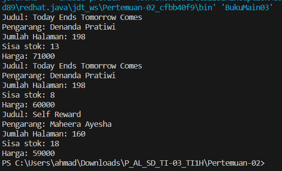

#### 2.3.3 Pertanyaan
1. Pada class Buku di Percobaan 3, tunjukkan baris kode program yang digunakan untuk mendeklarasikan konstruktor berparameter!
Jawaban : 
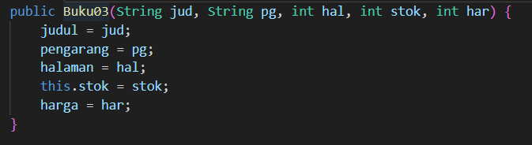

2. Perhatikan class BukuMain. Apa sebenarnya yang dilakukan pada baris program berikut?
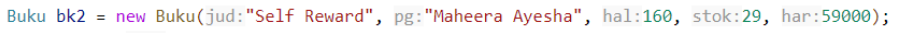
Jawaban : Instansiasi (Pembuatan objek dari class)

3. Hapus konstruktor default pada class Buku, kemudian compile dan run program. Bagaimana hasilnya? Jelaskan mengapa hasilnya demikian!
Jawaban : 
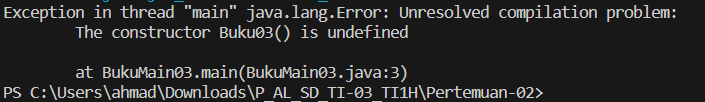
Karena pada baris berikut 

dideklarasikan class Buku default tanpa parameter, sementara pada Buku hanya terdapat class Buku dengan parameter sehingga hasil runningnya class Buku tidak diketahui.

4. Setelah melakukan instansiasi object, apakah method di dalam class Buku harus diakses secara berurutan? Jelaskan alasannya!
Jawaban : Tidak harus diakses berurutan, karena method dalam class di buat dengan fungsi yang berbeda-beda. Sehingga method dalam class dapat dipanggil sesuai dengan keinginan dan sesuai kebutuhan.
5. Buat object baru dengan nama buku"NamaMahasiswa" menggunakan konstruktor berparameter dari class Buku!
Jawaban : 
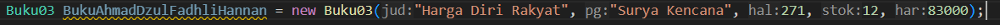

6. Commit dan push kode program ke Github

### 2.4 Latihan Praktikum
#### Soal 1. Pada class Buku yang telah dibuat, tambahkan tiga method yaitu hitungHargaTotal(), hitungDiskon(), dan hitungHargaBayar() dengan penjelasan sebagai berikut:
##### o Method hitungHargaTotal() digunakan untuk menghitung harga total yang merupakan perkalian antara harga dengan jumlah buku yang terjual
##### o Method hitungDiskon() digunakan untuk menghitung diskon dengan aturan berikut:
▪ Jika harga total lebih dari 150000, maka harga didiskon sebesar 12%  
▪ Jika harga total antara 75000 sampai 150000, maka harga didiskon sebesar 5%  
▪ Jika harga total kurang dari 75000, maka harga tidak didiskon  
##### o Method hitungHargaBayar() digunakan untuk menghitung harga total setelah dikurangi diskon
#### Class diagram Buku setelah penambahan ketiga method tersebut adalah sebagai berikut.
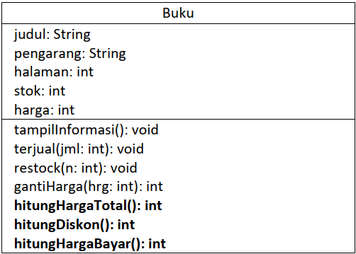
Jawaban :  
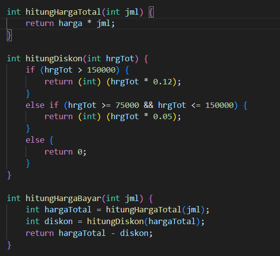  
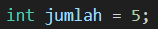
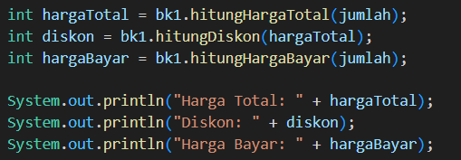
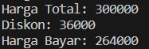

#### Soal 2. Buat program berdasarkan class diagram berikut ini!
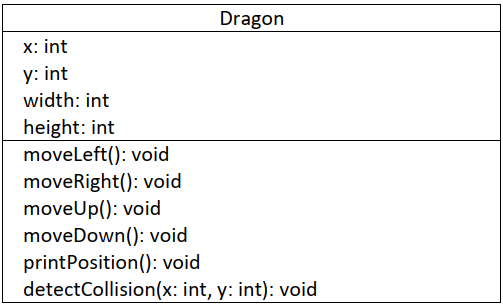

#### Penjelasan dari atribut dan method pada class Dragon tersebut adalah sebagai berikut:
##### • Atribut x digunakan untuk menyimpan posisi koordinat x (mendatar) dari dragon, sedangkan atribut y untuk posisi koordinat y (vertikal)
##### • Atribut width digunakan untuk menyimpan lebar dari area permainan, sedangkan height untuk menyimpan panjang area
##### • Method moveLeft() digunakan untuk mengubah posisi dragon ke kiri (koordinat x akan berkurang 1), sedangkan moveRight() untuk bergerak ke kanan (koordinat x akan bertambah 1). Perlu diperhatikan bahwa koordinat x tidak boleh lebih kecil dari 0 atau lebih besar dari nilai width. Jika koordinat x < 0 atau x > width maka panggil method detectCollision()
##### • Method moveUp() digunakan untuk mengubah posisi dragon ke atas (koordinat y akan berkurang 1), sedangkan moveDown() untuk bergerak ke bawah (koordinat y akan bertambah1). Perlu diperhatikan bahwa koordinat y tidak boleh lebih kecil dari 0 atau lebih besar dari nilai height. Jika koordinat y < 0 atau y > height maka panggil method detectCollision()
##### • Method detectCollision() akan mencetak pesan “Game Over” apabila dragon menyentuh ujung area permainan.
Jawaban : 
• Atrubut dan Parameter
    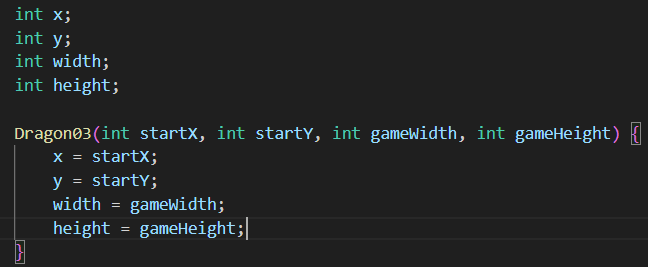
• Method moveLeft dan moveRight  
    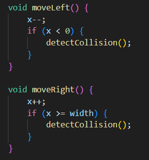  
• Method moveUp dan moveDown
    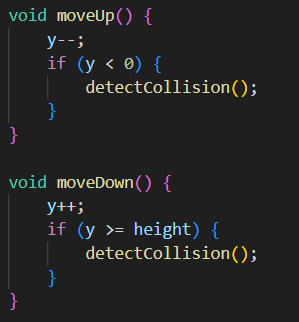  
• Method printPosition
    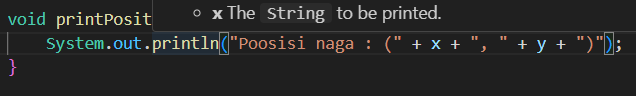
• Method detectCollision  
    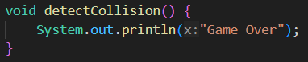
Done
