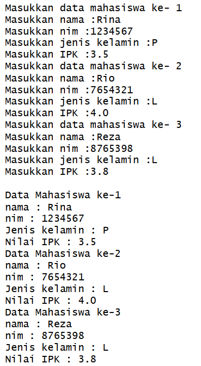

# Pertemuan 3 Praktikum Algoritma dan Struktur Data
  

Nama : AHMAD DZUL FADHLI HANNAN  
Nomor : 03  
Kelas : TI1H  
NIM : 2341720106

## 1. Tujuan Praktikum
1. Memahami dan menjelaskan fungsi array yang berisikan variabel objek.
2. Mahasiswa mampu menangkap logika tentang permasalahan array of object dalam Java
3. Mahasiswa mampu menerapkan pembuatan array of object dalam Java

## 2. Praktikum
### 2.1 Percobaan 1 : Membuat Array dari Object, Mengisi dan Menampilkan
#### 2.1.1 Langkah-langkah
#### 2.1.2 Verifikasi Hasil Percobaan
  

#### 2.1.3 Pertanyaan
1. Berdasarkan uji coba 3.2, apakah class yang akan dibuat array of object harus selalu memiliki atribut dan sekaligus method?Jelaskan!  
Jawaban : Tidak. Karena atribut dan method dapat dipanggil sesuai keinginan, tidak harus menyertakan keduanya dalam array of object. Pada percobaan 3.2 hanya dipanggil atribut dari class PersegiPanjang tanpa melakukan method apapun.
2. Apakah class PersegiPanjang memiliki konstruktor?Jika tidak, kenapa dilakukan pemanggilan konstruktur pada baris program berikut :
  

Jawaban : Tidak. Karena pada semua class pada java memiliki konstruktor meskipun kita tidak mendefinisikannya. Sehingga java akan secara otomatis membuat konstruktor default yang dapat dipanggil ketika membuat sebuah objek.  

3. Apa yang dimaksud dengan kode berikut ini:

Jawaban : Instansiasi objek of array dengan nama ppArray dan jumlah elemen 3.

4. Apa yang dimaksud dengan kode berikut ini:

Baris Ke-1 : Pemanggilan konstruktor pada elemen array indeks ke 2
Baris Ke-2 : Deklarasi nilai atribut "panjang" pada objek yang disimpan di ppArray[0] menjadi 110
Baris Ke-3 : Deklarasi nilai atribut "lebar" pada objek yang disimpan di ppArray[0] menjadi 40

5. Mengapa class main dan juga class PersegiPanjang dipisahkan pada uji coba 3.2?  
Jawaban : Tidak ada alasan khusus karena class main juga bisa dijadikan satu pada class PersegiPanjang. 

Hasil Running

Memisahkan class main dan class PersegiPanjang supaya kode program dapat lebih mudah dipahami.

### 2.2 Percobaan 2: Menerima Input Isian Array Menggunakan Looping
#### 2.2.1 Langkah-langkah
#### 2.2.2 Verifikasi Hasil Percobaan

#### 2.2.3 Pertanyaan 
1. Apakah array of object dapat diimplementasikan pada array 2 Dimensi?
Jawaban : Bisa.
2. Jika jawaban soal no satu iya, berikan contohnya! Jika tidak, jelaskan!
Jawaban : Contoh
Kode Program

Hasil Running

3. Jika diketahui terdapat class Persegi yang memiliki atribut sisi bertipe integer, maka kode dibawah ini akan memunculkan error saat dijalankan. Mengapa?

Jawaban : Karena setiap elemen array harus didefinisikan objeknya terlebih dahulu untuk mengakses atribut dari class Persegi. Contoh : ppArray[5] = new Persegi();

4. Modifikasi kode program pada praktikum 3.3 agar length array menjadi inputan dengan Scanner!
Jawaban : Modifikasi 

Hasil Running

5. Apakah boleh Jika terjadi duplikasi instansiasi array of objek, misalkan saja instansiasi dilakukan pada ppArray[i] sekaligus ppArray[0]?Jelaskan !
Jawaban :  Boleh, tetapi jika ada perubahan pada salah satu elemen, maka elemen yang sama lainnya juga akan berubah.

### 2.3 Percobaan 3: Penambahan Operasi Matematika di Dalam Method
#### 2.3.1 Langkah-langkah
#### 2.3.2 Verifikasi Hasil Percobaan

### Pertanyaan 
1. Dapatkah konstruktor berjumlah lebih dalam satu kelas? Jelaskan dengan contoh!
Jawaban : Bisa  
Kode program
  
Hasil Running  
  
Pada contoh diaatas terdapat 2 konstruktor pada satu class Contoh, yang pertama tidak ada parameter dan kedua dengan parameter.

2. Jika diketahui terdapat class Segitiga seperti berikut ini:

Tambahkan konstruktor pada class Segitiga tersebut yang berisi parameter int a, int t yang masing-masing digunakan untuk mengisikan atribut alas dan tinggi.  
Jawaban :   

3. Tambahkan method hitungLuas() dan hitungKeliling() pada class Segitiga
tersebut. Asumsi segitiga adalah segitiga siku-siku. (Hint: Anda dapat menggunakan bantuan library Math pada Java untuk mengkalkulasi sisi miring)  
Jawaban :   

4. Pada fungsi main, buat array Segitiga sgArray yang berisi 4 elemen, isikan masing-masing
atributnya sebagai berikut:  
sgArray ke-0 alas: 10, tinggi: 4  
sgArray ke-1 alas: 20, tinggi: 10  
sgArray ke-2 alas: 15, tinggi: 6  
sgArray ke-3 alas: 25, tinggi: 10  
Jawaban :  
  

5. Kemudian menggunakan looping, cetak luas dan keliling dengan cara memanggil method hitungLuas() dan hitungKeliling().  
Jawaban : 

Hasil running  

## 2.4 Latihan Praktikum
1. Buatlah program yang dapat menghitung luas permukaan dan volume bangun ruang kerucut, limas segi empat sama sisi, dan bola. Buatlah 3 (tiga) class sesuai dengan jumlah jenis bangun ruang. Buatlah satu main class untuk membuat array of objects yang menginputkan atribut-atribut yang ada menggunakan konstruktor semua bangun ruang tersebut. Dengan ketentuan,  
a. Buat looping untuk menginputkan masing-masing atributnya, kemudian tampilkan
luas permukaan dan volume dari tiap jenis bangun ruang tersebut.    
b. Pada kerucut, inputan untuk atribut hanya jari-jari dan sisi miring  
c. Pada limas segi empat sama sisi, inputan untuk atribut hanya panjang sisi alas dan tinggi limas  
d. Pada bola, inpuntan untuk atribut hanya jari-jari

Jawaban :   

2. Sebuah kampus membutuhkan program untuk menampilkan informasi mahasiswa berupa nama, nim, jenis kelamin dan juga IPK mahasiswa. Program dapat menerima input semua informasi tersebut, kemudian menampilkanya kembali ke user. Implementasikan program tersebut jika dimisalkan terdapat 3 data mahasiswa yang tersedia. Contoh output program:  

Jawaban :   

3. Modifikasi program Latihan no.2 di atas, sehingga bisa digunakan untuk menghitung rata-rata IPK, serta menampilkan data mahasiswa dengan IPK terbesar! (gunakan method untuk masing-masing proses tersebut)  
Jawaban :   

