# Pertemuan 5 Praktikum Algoritma dan Struktur Data
  

Nama : AHMAD DZUL FADHLI HANNAN  
Nomor : 03  
Kelas : TI1H  
NIM : 2341720106

## 1. Tujuan Praktikum
1.	Mahasiswa mampu membuat algoritma bruteforce dan divide-conquer
2.	Mahasiswa mampu menerapkan penggunaan algorima bruteforce dan divide-conquer

## 2. Praktikum
### 2.1 Percobaan 1 :   Menghitung Nilai Faktorial dengan Algoritma Brute Force dan Divide and Conquer
#### 2.1.1 Langkah-langkah
#### 2.1.2 Verifikasi Hasil Percobaan
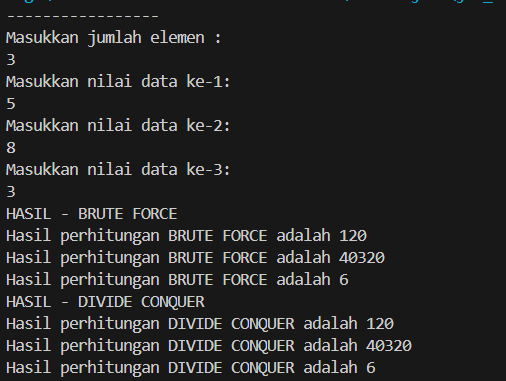

#### 2.1.3 Pertanyaan
1. Pada base line Algoritma Divide Conquer untuk melakukan pencarian nilai faktorial, jelaskan perbedaan bagian kode pada penggunaan if dan else!

Jawaban :  if, ketika n bernilai 1, maka langsung dikembalikan nilai 1 tanpa melakukan rekursi lebih lanjut. Ini merupakan kondisi dasar atau kondisi terminasi dari rekursi, di mana pencarian nilai faktorial berhenti karena sudah mencapai angka 1.  else, jika n tidak sama dengan 1, maka nilai faktorial dihitung dengan cara mengalikan n dengan nilai faktorial dari n-1. Ini menciptakan rekursi, di mana perhitungan nilai faktorial dilakukan secara berulang dengan nilai yang semakin kecil hingga mencapai kondisi terminasi (n==1).

2.	Apakah memungkinkan perulangan pada method faktorialBF() dirubah selain menggunakan for?Buktikan!

Jawaban : Bisa, menggunakan while.  
    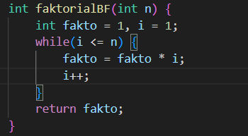  
    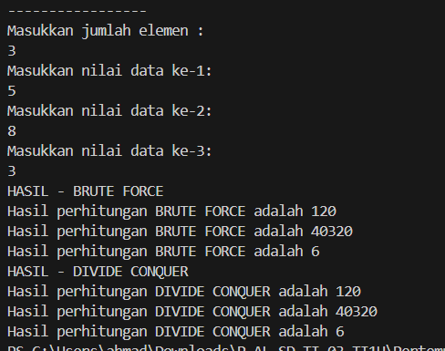

3.	Jelaskan perbedaan antara fakto *= i; dan int fakto = n * faktorialDC(n-1); !

Jawaban :   
- fakto *= i : fakto akan dikalikan dengan nilai i dan hasilnya akan disimpan kembali ke dalam fakto.   
- fakto = n * faktorialDC(n-1) : nilai faktorial untuk n dihitung dengan mengalikan n dengan nilai faktorial dari n-1. Ini berarti nilai faktorial untuk n-1 akan dihitung secara rekursif sampai mencapai kondisi terminasi n==1.

### 2.2 Percobaan 2: Menghitung Hasil Pangkat dengan Algoritma Brute Force dan Divide and Conquer
#### 2.2.1 Langkah-langkah
#### 2.2.2 Verifikasi Hasil Percobaan
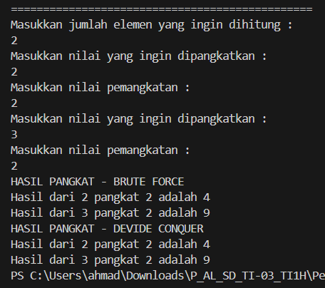

#### 2.2.3 Pertanyaan 
1.	Jelaskan mengenai perbedaan 2 method yang dibuat yaitu PangkatBF() dan PangkatDC()!  
Jawaban : 
- PangkatBF() : menggunakan pendekatan brute force dengan mengalikan nilai a sebanyak n-1 kali.
- PangkatDC() : menggunakan pendekatan devide conquer dengan menghitung hasil pangkat dari a dengan pangkat n/2 dan mengalikan hasilnya dengan dirinya sendiri jika n ganjil.

2.	Apakah tahap combine sudah termasuk dalam kode tersebut?Tunjukkan!  
Jawaban : Sudah.  
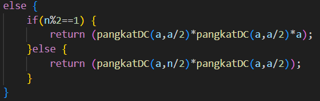  
3.	Modifikasi kode program tersebut, anggap proses pengisian atribut dilakukan dengan konstruktor.
Jawaban :  
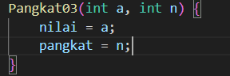  
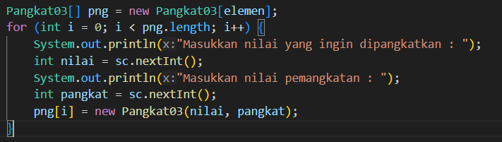  
4.	Tambahkan menu agar salah satu method yang terpilih saja yang akan dijalankan menggunakan switch-case!
Jawaban :  
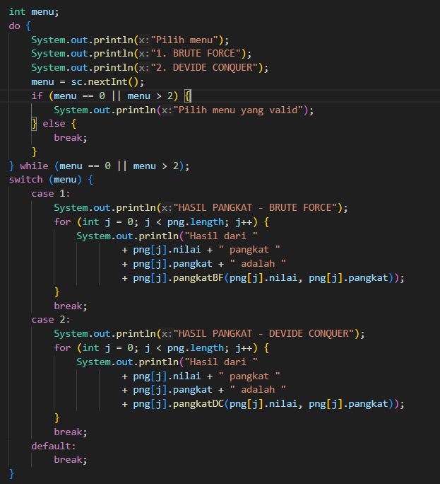  
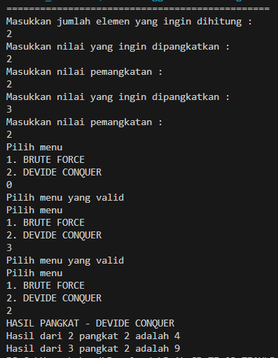  

### 2.3 Percobaan 3: Menghitung Sum Array dengan Algoritma Brute Force dan Divide and Conquer
#### 2.3.1 Langkah-langkah
#### 2.3.2 Verifikasi Hasil Percobaan
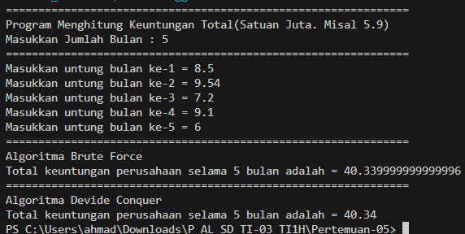 

### Pertanyaan 
1.	Mengapa terdapat formulasi return value berikut?Jelaskan!
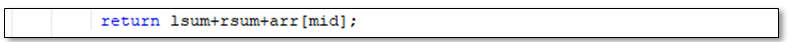  
Jawaban : Untuk menjumlahkan elemen-elemen yang dipecah menjadi 
- lsum(penjumlahan elemen bagian kiri dari indeks 1 sampai mid-1), 
- rsum (penjumlahan elemen bagian kanan dari indek mid+1 sampai r), 
- dan mid (elemen bagian tengah atau indeks tengah)

2.	Kenapa dibutuhkan variable mid pada method TotalDC()?  
Jawaban : Untuk menentukan indeks elemen tengah jika terjadi kondisi dimana jumlah elemen l lebih kecil dari jumlah elemen r.

3.	Program perhitungan keuntungan suatu perusahaan ini hanya untuk satu perusahaan saja. Bagaimana cara menghitung sekaligus keuntungan beberapa bulan untuk beberapa perusahaan.(Setiap perusahaan bisa saja memiliki jumlah bulan berbeda-beda)? Buktikan dengan program!  
Jawaban :  
class  
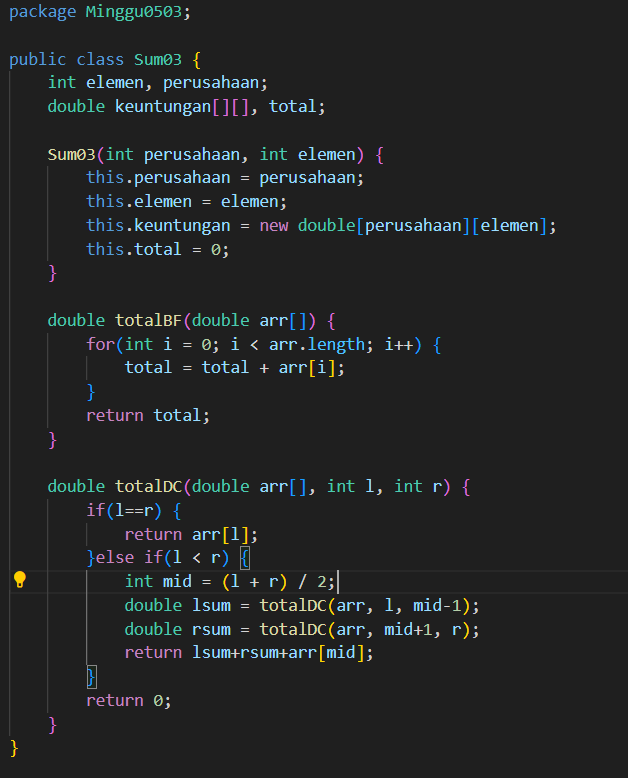  

main  
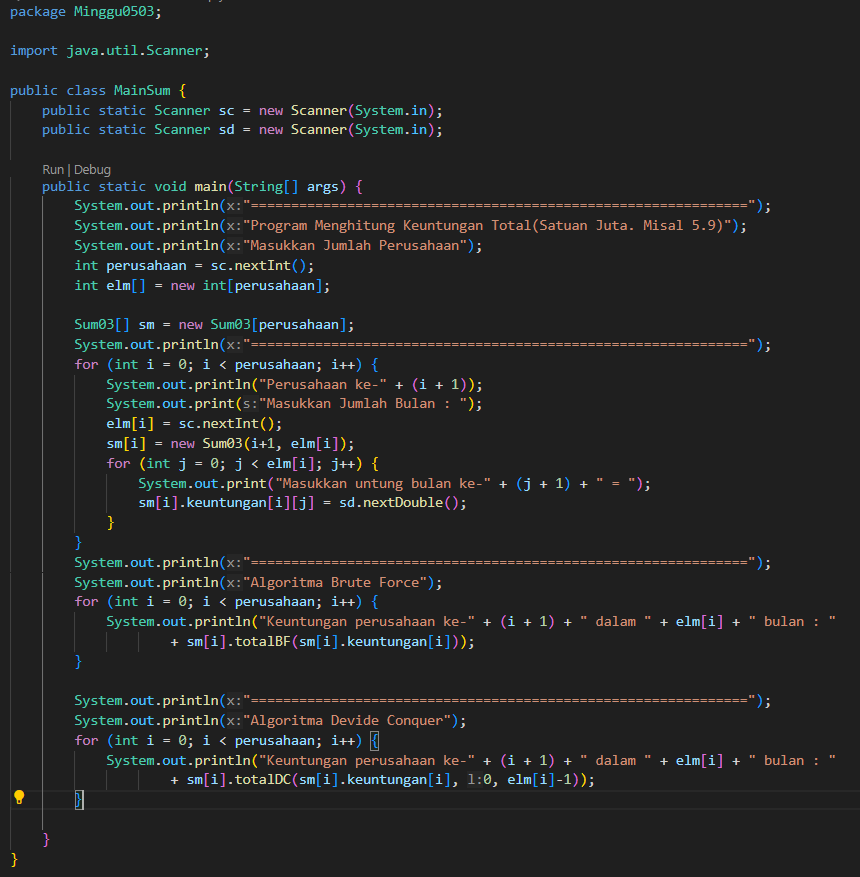  

running  
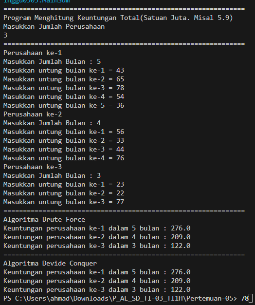  

## 2.4 Latihan Praktikum
1.	Sebuah showroom memiliki daftar mobil dengan data sesuai tabel di bawah ini  
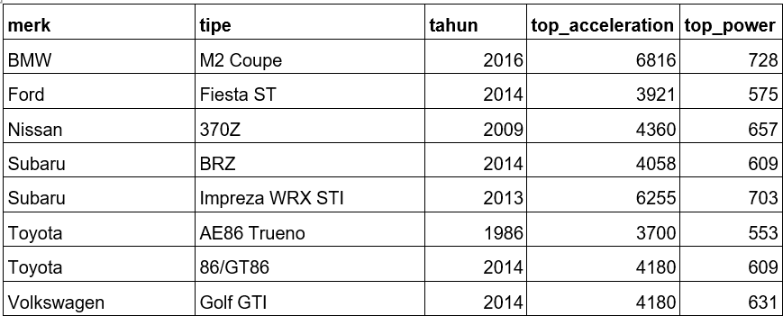  
Tentukan:   
a.	top_acceleration tertinggi menggunakan Divide and Conquer!  
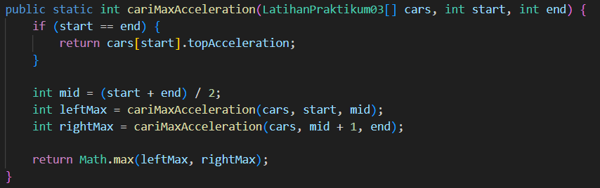   
  
b.	top_acceleration terendah menggunakan Divide and Conquer!  
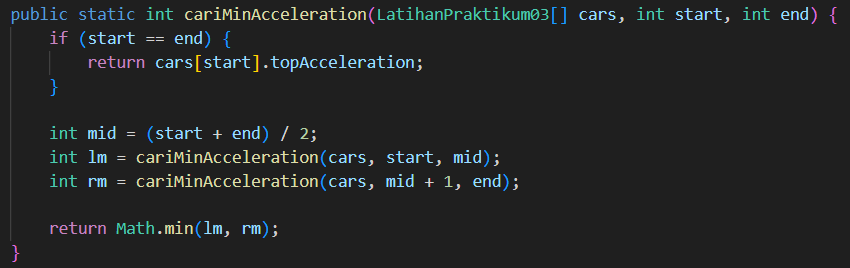  

c.	Rata-rata top_power dari seluruh mobil menggunakan Brute Force!
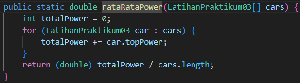  

Running :  
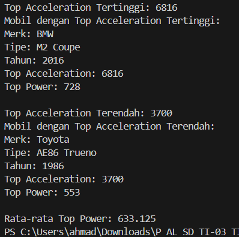

