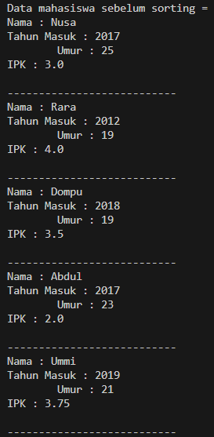
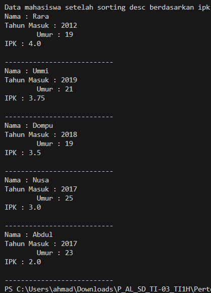
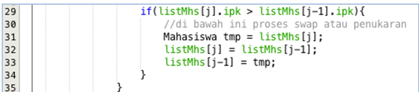
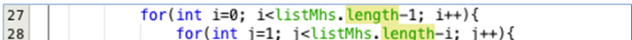
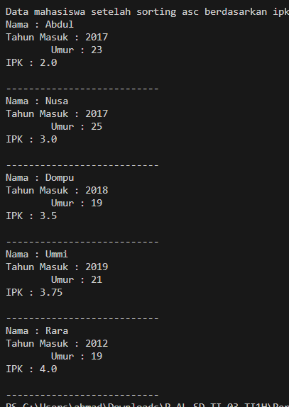
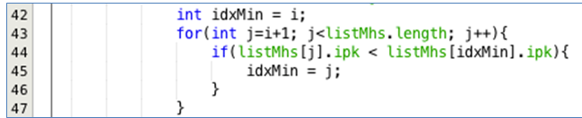
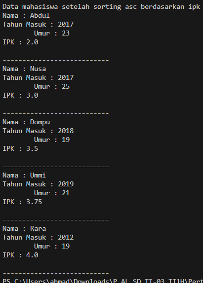

# Pertemuan 6 Praktikum Algoritma dan Struktur Data
  

Nama : AHMAD DZUL FADHLI HANNAN  
Nomor : 03  
Kelas : TI1H  
NIM : 2341720106

## 1. Tujuan Praktikum
a.	Mahasiswa mampu membuat algoritma searching bubble sort, selection sort dan insertion sort
b.	Mahasiswa mampu menerapkan algoritma searching bubble sort, selection sort dan insertion sort pada program
 
## 2. Praktikum
### 2.1 Percobaan 1 : Mengurutkan Data Mahasiswa Berdasarkan IPK Menggunakan Bubble Sort 
#### 2.1.1 Langkah-langkah
#### 2.1.2 Verifikasi Hasil Percobaan
  

  

#### 2.1.3 Pertanyaan
1. Terdapat di method apakah proses bubble sort?  
Jawaban : bubbleSort()
2. Di dalam method bubbleSort(), terdapat baris program seperti di bawah ini:
  
Untuk apakah proses tersebut?  
Jawaban : Jika ipk pada index j lebih besar dari ipk pada index j-1, maka akan terjadi swap atau penukaran nilai ipk antara ipk indkes j dan j-1 

3.	Perhatikan perulangan di dalam bubbleSort() di bawah ini:   
  

a.	Apakah perbedaan antara kegunaan perulangan i dan perulangan j?  
b.	Mengapa syarat dari perulangan i adalah i<listMhs.length-1 ?  
c.	Mengapa syarat dari perulangan j adalah j<listMhs.length-i ?  
d.	Jika banyak data di dalam listMhs adalah 50, maka berapakali perulangan i akan berlangsung? Dan ada berapa Tahap bubble sort yang ditempuh?

Jawaban :   

a.  Perulangan i : banyak tahap yang perlu dilakukan untuk mengurutkan data, dan data akan terurut pada tahap jumlahData-1.  
    Perulangan j : banyaknya langkah yang dilakukan dalam tahap i dan j akan diekseskusi sebanyak j-i karena bubble sorting akan menyimpan data yang terurut mulai dari posisi paling belakang.    

b.  i (i<listMhs.length-1 ) : banyaknya tahap yang harus dilakukan sampai data terurut.  

c. j (j<listMhs.length-i ) : banyaknya langkah dalam tahap yang dilakukan dimana data yang sudah terurut akan diposisikan paling belakang sehingga tidak perlu diurutkan lagi.  

d. Jika banyak data 50 maka perulangan i akan berlangsung sebanyak 49 kali dan banyak tahap yang bubble sort yang ditempuh sebanyak 49 kali.   

### 2.2 Percobaan 2 : engurutkan Data Mahasiswa Berdasarkan IPK Menggunakan Selection Sort 
#### 2.2.1 Langkah-langkah
#### 2.2.2 Verifikasi Hasil Percobaan
  

 

#### 2.2.3 Pertanyaan 
Di dalam method selection sort, terdapat baris program seperti di bawah ini:  
  
Untuk apakah proses tersebut, jelaskan!  
Jawaban : Untuk membandingkan ipk pada indeks idxMin dengan ipk pada indeks j / i+1 hingga listMhs.length, dan jika ipk pada indeks idxMin lebih kecil dari ipk indeks j maka nilai ipk pada indeks idxMin akan diganti dengan j. 

### 2.3 Percobaan 3: Mengurutkan Data Mahasiswa Berdasarkan IPK Menggunakan Insertion Sort 
#### 2.3.1 Langkah-langkah
#### 2.3.2 Verifikasi Hasil Percobaan
 

  

#### 2.3.3 Pertanyaan 

Ubahlah fungsi pada InsertionSort sehingga fungsi ini dapat melaksanakan proses sorting dengan cara descending.  
  
Ubah perbandingan " > " pada "listMhs[j-1].ipk > temp.ipk" menjadi "<"  
  

## 2.4 Latihan Praktikum
Sebuah platform travel yang menyediakan layanan pemesanan kebutuhan travelling sedang mengembangkan backend untuk sistem pemesanan/reservasi akomodasi (penginapan), salah satu fiturnya adalah menampilkan daftar penginapan yang tersedia berdasarkan pilihan filter yang diinginkan user. Daftar penginapan ini harus dapat disorting berdasarkan
1.	Harga dimulai dari harga termurah ke harga tertinggi.
2.	Rating bintang penginapan dari bintang tertinggi (5) ke terendah (1)
Buatlah proses sorting data untuk kedua filter tersebut dengan menggunakan algoritma
bubble sort dan selection sort.  
  

Jawaban :  

### Data sebelum terurut  
  

### Bubble Sorting
Harga  
Kode program  
  
Running  
  

Rating  
Kode program  
  
Running  
  

### Selection Sorting
Harga  
Kode program  
  
Running  
  

Rating  
Kode program  
  
Running  
  

