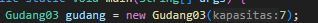

# Pertemuan 8 Praktikum Algoritma dan Struktur Data
  

Nama : AHMAD DZUL FADHLI HANNAN  
Nomor : 03  
Kelas : TI1H  
NIM : 2341720106

## 1. Tujuan Praktikum
1.	Membuat struktur data Stack
2.	Menerapkan algoritma Stack ke dalam program

 
## 2. Praktikum
### 2.1 Percobaan 1 : Penyimpanan Tumpukan Barang dalam Gudang
#### 2.1.1 Langkah-langkah
#### 2.1.2 Verifikasi Hasil Percobaan  
Data Ditemukan  
  

#### 2.1.3 Pertanyaan
1.	Lakukan perbaikan pada kode program, sehingga keluaran yang dihasilkan sama dengan verifikasi hasil percobaan! Bagian mana saja yang perlu diperbaiki?
Jawaban : Pada class Gudang method tampilkanBarang() bagian kode berikut :  
  
Diubah menjadi seperti berikut :  
  
Supaya perulangan dimulai dari indeks terakhir. Sehingga menampilkan dari tumpukan barang teratas sampai ke bawah :  
  
Dan ubah isEmpty() menjadi cekKosong karena method isEmpty tidak ada.  

2.	Berapa banyak data barang yang dapat ditampung di dalam tumpukan? Tunjukkan potongan kode programnya!  
Jawaban : Ada 7 data yang dapat ditampung di dalam tumpukan.  
  

3.	Mengapa perlu pengecekan kondisi !cekKosong() pada method tampilkanBarang? Kalau kondisi tersebut dihapus, apa dampaknya?  
Jawaban : Pengecekan kondisi !cekKosong() pada method tampilkanBarang diperlukan untuk memastikan bahwa tumpukan barang tidak kosong sebelum menampilkan barang. Jika kondisi tersebut dihapus, maka program akan mencoba menampilkan barang dari tumpukan meskipun tumpukan barang kosong, yang dapat menyebabkan error saat mencoba mengakses data yang tidak ada dalam tumpukan.  

4.	Modifikasi kode program pada class Utama sehingga pengguna juga dapat memilih operasi lihat barang teratas, serta dapat secara bebas menentukan kapasitas gudang!  
Jawaban :  
  
  
  

5.	Commit dan push kode program ke Github  
Jawaban :  
  

### 2.2 Percobaan 2 : Konversi Kode Barang ke Biner
#### 2.2.1 Langkah-langkah
#### 2.2.2 Verifikasi Hasil Percobaan  
  

#### 2.2.3 Pertanyaan  
1.	Pada method konversiDesimalKeBiner, ubah kondisi perulangan menjadi while (kode != 0), bagaimana hasilnya? Jelaskan alasannya!  
Jawaban :  
  
Hasilnya sama akan tetapi cara konversi desimal ke biner berbeda. Karena proses konversi dilakukan selama nilai kode masih berada di luar rentang 0. Dengan menggunakan while (kode != 0), proses konversi akan terus dilakukan selama nilai kode masih ada (tidak 0).

2.	Jelaskan alur kerja dari method konversiDesimalKeBiner!  
Jawaban :  
- Membuat objek stack dari class StackKonversi
- Selanjutnya, terdapat perulangan while (kode != 0) yang akan terus berlanjut selama nilai kode tidak sama dengan 0.
- Pada setiap iterasi perulangan, nilai kode dibagi dengan 2 dan sisa dari pembagian tersebut disimpan dalam variabel sisa.  
- Variabel sisa kemudian dipush ke dalam StackKonversi menggunakan method push().  
- Setelah itu, nilai kode dibagi dengan 2 dan hasilnya masukkan kembali ke dalam variabel kode.  
- Perulangan while (kode != 0) akan terus berlanjut hingga nilai kode menjadi 0.  
- Setelah perulangan selesai, variabel biner dibuat sebagai sebuah string kosong.  
- Selanjutnya, terdapat perulangan while (!stack.isEmpty()) yang akan terus berlanjut selama StackKonversi tidak kosong.  
- Pada setiap iterasi perulangan, nilai teratas pada StackKonversi diambil menggunakan method pop() dan ditambahkan ke variabel biner.  
- Setelah itu, nilai teratas pada StackKonversi dihapus menggunakan method pop().  
- Perulangan while (!stack.isEmpty()) akan terus berlanjut hingga StackKonversi kosong.  
- Setelah perulangan selesai, variabel biner berisi hasil konversi desimal ke biner dalam bentuk string.  
- Variabel biner kemudian dikembalikan sebagai hasil dari method konversiDesimalKeBiner.  

### 2.3 Percobaan 3: Konversi Notasi Infix ke Postfix  
#### 2.3.1 Langkah-langkah
#### 2.3.2 Verifikasi Hasil Percobaan
  

#### 2.2.3 Pertanyaan  
1.	Pada method derajat, mengapa return value beberapa case bernilai sama? Apabila return value diubah dengan nilai berbeda-beda setiap case-nya, apa yang terjadi?  
Jawaban :  
  
Return valuenya menyesuaikan dengan case operator mana yang harus diprioritaskan dan dieksekusi terlebih dahulu.  Sehingga jika return value nilainya berbeda-beda setiap case nya, maka operator dengan return value terbesar akan diprioritaskan dan dihitung terlebih dahulu, lalu berlanjut ke value dibawahnya sampai 0.

2.	Jelaskan alur kerja method konversi!  
Jawaban :  
•	Method konversi menerima sebuah string Q yang berisi postfix expression.  
•	Method ini membuat sebuah string kosong P yang akan menjadi hasil konversi.  
•	Method melakukan iterasi pada setiap karakter c dari string Q.  
•	Jika karakter c adalah operand, maka diaktifkan dalam string P.  
•	Jika karakter c adalah tanda kurung buka '(', maka diaktifkan pada stack.  
•	Jika karakter c adalah tanda kurung tutup ')', maka selama karakter teratas pada stack bukan tanda kurung buka, karakter tersebut diaktifkan dalam string P. Setelah itu, karakter teratas pada stack dihapus dari stack.  
•	Jika karakter c adalah operator, maka selama derajat operator pada stack lebih tinggi atau sama dengan derajat operator c, operator tersebut diaktifkan dalam string P.  
•	Setelah iterasi selesai, method konversi mengembalikan string P yang berisi hasil konversi dari postfix expression.  

3.	Pada method konversi, apa fungsi dari potongan kode berikut?  
   
Jawaban : Untuk mengkonversi setiap karakter pada String Q menjadi char c[0] --> c[i].

## 2.4 Latihan Praktikum
Perhatikan dan gunakan kembali kode program pada Percobaan 1. Tambahkan dua method berikut pada class Gudang:  
•	Method lihatBarangTerbawah digunakan untuk mengecek barang pada tumpukan terbawah  
•	Method cariBarang digunakan untuk mencari ada atau tidaknya barang berdasarkan kode barangnya atau nama barangnya  
Jawaban :  
  

  

