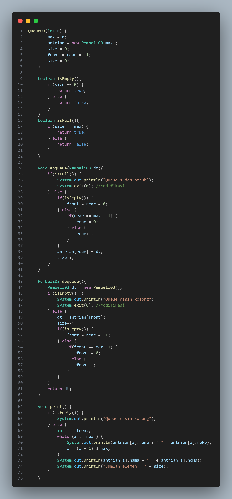

# Pertemuan 9 Praktikum Algoritma dan Struktur Data
  

Nama : AHMAD DZUL FADHLI HANNAN  
Nomor : 03  
Kelas : TI1H  
NIM : 2341720106

## 1. Tujuan Praktikum
Setelah melakukan materi praktikum ini, mahasiswa mampu:
1.	Mengenal struktur data Queue
2.	Membuat dan mendeklarasikan struktur data Queue
3.	Menerapkan algoritma Queue dengan menggunakan array
 
## 2. Praktikum
### 2.1 Percobaan 1
#### 2.1.1 Langkah-langkah
#### 2.1.2 Verifikasi Hasil Percobaan  
Data Ditemukan  
  

#### 2.1.3 Pertanyaan
1.	Pada konstruktor, mengapa nilai awal atribut front dan rear bernilai -1, sementara atribut size bernilai 0?  
Jawaban : Nilai awal front dan rear bernilai -1 karena kita belum memiliki elemen di dalam queue. Sedangkan size bernilai 0 karena tidak ada elemen yang ada dalam queue.  

2.	Pada method Enqueue, jelaskan maksud dan kegunaan dari potongan kode berikut!  
  
Jawaban : Jika rear sama dengan max - 1, itu berarti bahwa rear sudah mencapai posisi terakhir yang tersedia dalam struktur data. Kemudian nilai rear diatur kembali menjadi 0, sehingga elemen baru akan ditambahkan di posisi awal kembali.  

3.	Pada method Dequeue, jelaskan maksud dan kegunaan dari potongan kode berikut!
  
Jawaban : Jika front sama dengan max - 1, itu berarti bahwa front sudah mencapai posisi terakhir yang tersedia dalam struktur data. Kemudian nilai front diatur kembali menjadi 0, sehingga elemen pertama akan dihapus dari posisi awal kembali.  

4.	Pada method print, mengapa pada proses perulangan variabel i tidak dimulai dari 0 (int i=0), melainkan int i=front?  
Jawaban : Karena method print akan mencetak elemen-elemen dalam queue mulai dari elemen pertama yang ada di front.  
5.	Perhatikan kembali method print, jelaskan maksud dari potongan kode berikut!
  
Jawaban :  Untuk mengupdate nilai variabel i setelah setiap iterasi dalam perulangan.  

6.	Tunjukkan potongan kode program yang merupakan queue overflow!  
Jawaban :  
  

7.	Pada saat terjadi queue overflow dan queue underflow, program tersebut tetap dapat berjalan dan hanya menampilkan teks informasi. Lakukan modifikasi program sehingga pada saat terjadi queue overflow dan queue underflow, program dihentikan!  
Jawaban :  
  

### 2.2 Percobaan 2
#### 2.2.1 Langkah-langkah
#### 2.2.2 Verifikasi Hasil Percobaan  
  

#### 2.2.3 Pertanyaan  
1.	Pada class QueueMain, jelaskan fungsi IF pada potongan kode program berikut!  
  
Jawaban : Untuk memeriksa kondisi pada data jika data tidak sama dengan null atau 0, maka akan diprint "antrian dikeluarkan".  

2.	Lakukan modifikasi program dengan menambahkan method baru bernama peekRear pada class Queue yang digunakan untuk mengecek antrian yang berada di posisi belakang! Tambahkan pula daftar menu 5. Cek Antrian paling belakang pada class QueueMain sehingga method peekRear dapat dipanggil!  
Jawaban :  
  
  
  
  

### 2.3 Tugas
1. Buatlah program antrian untuk mengilustasikan pesanan disebuah warung. Ketika seorang pembeli akan mengantri, maka dia harus mendaftarkan nama, dan nomor HP seperti yang digambarkan pada Class diagram berikut:  
  
Class diagram Queue digambarkan sebagai berikut:  
  
Keterangan:  
•	Method create(), isEmpty(), isFull(), enqueue(), dequeue() dan print(), kegunaannya sama seperti yang telah dibuat pada Praktikum  
  

•	Method peek(): digunakan untuk menampilkan data Pembeli yang berada di posisi antrian paling depan  
  

•	Method peekRear(): digunakan untuk menampilkan data Pembeli yang berada di posisi antrian paling belakang  
  

•	Method peekPosition(): digunakan untuk menampilkan seorang pembeli (berdasarkan nama) posisi antrian ke berapa  
  

•	Method daftarPembeli(): digunakan untuk menampilkan data seluruh pembeli  
  

Running  
  
  

