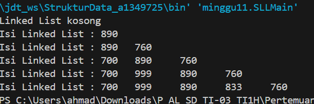

# Pertemuan 9 Praktikum Algoritma dan Struktur Data
  

Nama : AHMAD DZUL FADHLI HANNAN  
Nomor : 03  
Kelas : TI1H  
NIM : 2341720106

## 1. Tujuan Praktikum
Setelah melakukan materi praktikum ini, mahasiswa mampu:
1.	Membuat struktur data linked list
2.	Membuat linked list pada program
3.	Membedakan permasalahan apa yang dapat diselesaikan menggunakan linked list
 
## 2. Praktikum
### 2.1 Percobaan 1
#### 2.1.1 Langkah-langkah
#### 2.1.2 Verifikasi Hasil Percobaan  
Data Ditemukan  
  

#### 2.1.3 Pertanyaan
1.	Mengapa hasil compile kode program di baris pertama menghasilkan “Linked List Kosong”?  
Jawaban :  Karena pada class SLLMain dipanggil method print terlebih dahulu sehingga Linked List masih dalam kondisi kosong.  
2.	Jelaskan kegunaan variable temp secara umum pada setiap method!  
Jawaban :  
- Method print : untuk  print linked list mulai dari head sampai kondisi temp sama dengan null, dan jika kondisi head sama dengan null maka akan dipritn "Linked List kosong"  
- Method insertAfter : untuk menemukan node dengan kunci yang ditentukan dalam linked list sehingga node baru dapat dimasukkan setelahnya.  
- Method insertAt : untuk menemukan node pada indeks yang ditentukan dalam linked list sehingga node baru dapat dimasukkan pada posisi tersebut.  
3.	Perhatikan class SingleLinkedList, pada method insertAt Jelaskan kegunaan kode berikut  
  
Jawaban : Jika kondisi temp.next.next == null terpenuhi, itu berarti temp adalah node yang berada di node sebelum node terakhir dalam linked list. Atau ini memeriksa apakah temp adalah node sebelum node terakhir dalam linked list.  

### 2.2 Percobaan 2  2.2	Modifikasi Elemen pada Single Linked List  
#### 2.2.1 Langkah-langkah  
#### 2.2.2 Verifikasi Hasil Percobaan  
  

#### 2.2.3 Pertanyaan  
1.	Mengapa digunakan keyword break pada fungsi remove? Jelaskan!  
Jawaban : Jika elemen yang ingin dihapus ditemukan, break digunakan untuk menghentikan iterasi sehingga tidak perlu melanjutkan pengecekan elemen berikutnya setelah elemen tersebut dihapus.  
2.	Jelaskan kegunaan kode dibawah pada method remove  
  
Jawaban : Jika elemen berikutnya memiliki nilai yang sama dengan key terpenuhi, maka temp.next akan dihapus dengan mengatur temp.next menjadi temp.next.next. Ini berarti elemen yang ingin dihapus akan di-skip dan tidak akan termasuk dalam linked list.  

### 2.3 Tugas

1. Implementasikan ilustrasi Linked List Berikut. Gunakan 4 macam penambahan data yang telah dipelajari sebelumnya untuk menginputkan data.  
  
Jawaban :  
  
  

2. Buatlah implementasi program antrian layanan unit kemahasiswaan sesuai dengan kondisi yang ditunjukkan pada soal nomor 1! Ketentuan
a.	Implementasi antrian menggunakan Queue berbasis Linked List!
b.	Program merupakan proyek baru, bukan modifikasi dari soal nomor 1!

