# Pertemuan 11 Praktikum Algoritma dan Struktur Data
  

Nama : AHMAD DZUL FADHLI HANNAN  
Nomor : 03  
Kelas : TI1H  
NIM : 2341720106

## 1. Tujuan Praktikum
Setelah melakukan praktikum ini, mahasiswa mampu:
1.	memahami algoritma double linked lists;
2.	membuat dan mendeklarasikan struktur algoritma double linked lists;
3.	menerapkan algoritma double linked lists dalam beberapa study case.
 
## 2. Praktikum
### 2.1 Percobaan 1
#### 2.1.1 Langkah-langkah
#### 2.1.2 Verifikasi Hasil Percobaan  
Data Ditemukan  
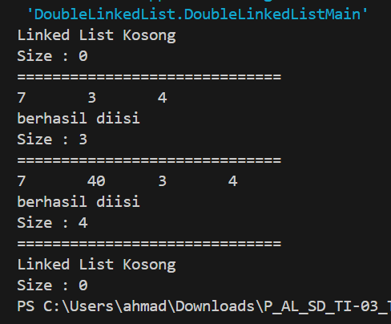  

#### 2.1.3 Pertanyaan
1.	Jelaskan perbedaan antara single linked list dengan double linked lists!  
Jawaban : Single linked list hanya memiliki pointer ke elemen selanjutnya, sedangkan double linked list memiliki pointer ke elemen sebelumnya dan ke elemen selanjutnya.  

2.	Perhatikan class Node, di dalamnya terdapat atribut next dan prev. Untuk apakah atribut tersebut?  
Jawaban : next digunakan untuk mengarah ke elemen selanjutnya, sedangkan prev digunakan untuk mengarah ke elemen sebelumnya.  

3. Perhatikan konstruktor pada class DoubleLinkedLists. Apa kegunaan inisialisasi atribut head dan size seperti pada gambar berikut ini?  
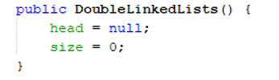  
Jawaban : Untuk mengatur kondisi awal linked list dalam kondisi kosong.  

4. Pada method addFirst(), kenapa dalam pembuatan object dari konstruktor class Node prev dianggap sama dengan null?  
Node newNode = new Node(null, item, head);  
Jawaban : Karena item ditambahkan pada posisi paling awal, dimana prev item posisi awal sama dengan null.  

5.	Perhatikan pada method addFirst(). Apakah arti statement head.prev = newNode ?  
Jawaban : Untuk mengatur previous pada head sebelumnya agar terhubung dengan newNode.  

6.	Perhatikan isi method addLast(), apa arti dari pembuatan object Node dengan mengisikan parameter prev dengan current, dan next dengan null?  
Node newNode = new Node(current, item, null);  
Jawaban : Supaya item yang ditambahkan pada posisi tail prev nya terhubung dengan current, dan karena posisi tail maka next dari item tersebut adalah null.  

7. Pada method add(), terdapat potongan kode program sebagai berikut :  
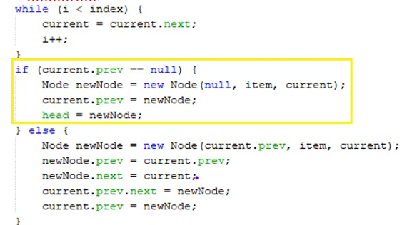  

jelaskan maksud dari bagian yang ditandai dengan kotak kuning.  
Jawaban : Sama dengan method addFirst() dimana jika kondisi prev sama dengan null, dan kondisi tersebut hanya ada pada bagian head. Selanjutnya akan ditambahkan item pada posisi head dengan prev sama dengan null dan next sama dengan current, dan head yang lama akan berpindah ke posisi selanjutnya dengan prev sama dengan head yang baru.

### 2.2 Percobaan 2  
#### 2.2.1 Langkah-langkah  
#### 2.2.2 Verifikasi Hasil Percobaan  
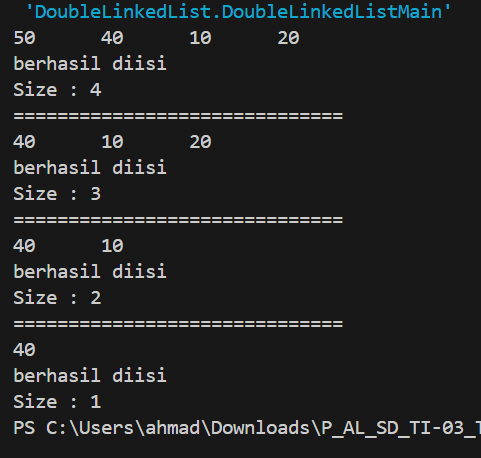  

#### 2.2.3 Pertanyaan  
1.	Apakah maksud statement berikut pada method removeFirst()?  
head = head.next;  
head.prev = null;  
Jawaban : Untuk mengatur head yang baru adalah item setelah head dan prev head adalah null.  
2.	Bagaimana cara mendeteksi posisi data ada pada bagian akhir pada method removeLast()?  
Jawaban : dengan menggunakan perulangan berikut :  
while (current.next.next != null) {
            current = current.next;
        }  
Dimana akan terjadi pengecekan current yang dimulai dari head lalu lanjut ke elemen berikutnya sampai current.next.next nilainya null. Dan jika sudah berhenti perulangannya maka elemen pada current.next akan dihapus.  
3.	Jelaskan alasan potongan kode program di bawah ini tidak cocok untuk perintah remove!  
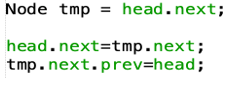  

Jawaban : Karena metode remove yang sebenarnya digunakan untuk menghapus elemen di indeks tertentu, sedangkan kode tersebut hanya digunakan untuk menghapus elemen pertama.  
4.	Jelaskan fungsi kode program berikut ini pada fungsi remove!  
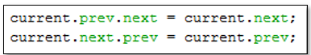  
Jawaban : Elemen sebelumnya sekarang akan terhubung ke elemen setelah elemen yang akan dihapus, mengabaikan elemen yang akan dihapus dari rantai.  

### 2.3 Percobaan 3  
#### 2.3.1 Langkah-langkah  
#### 2.3.2 Verifikasi Hasil Percobaan  
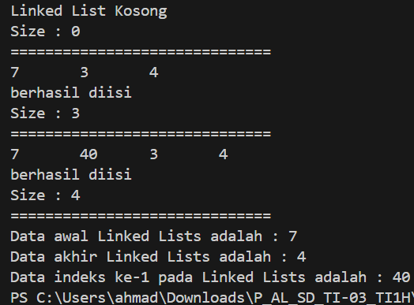  

#### 2.3.3 Pertanyaan  

1.	Jelaskan method size() pada class DoubleLinkedLists!  
Jawaban : Untuk mengembalikan nilai size yang terbaru.  
2.	Jelaskan cara mengatur indeks pada double linked lists supaya dapat dimulai dari indeks ke- 1!  
Jawaban : Dengan mengubah konsep indeksasi dari 0 menjadi 1. Hal ini dapat dilakukan dengan mengubah logika penambahan dan penghapusan elemen pada linked list.  
3.	Jelaskan perbedaan karakteristik fungsi Add pada Double Linked Lists dan Single Linked Lists!  
Jawaban :  
Double Linked Lists : Fungsi Add dapat menambahkan elemen pada posisi tertentu, dimana posisi dimulai dari 1 sampai dengan jumlah elemen yang ada di dalam linked list. Contoh: Add(1, 10) akan menambahkan elemen 10 pada posisi pertama.  

Single Linked Lists : Fungsi Add hanya dapat menambahkan elemen pada posisi paling akhir, dimana posisi dimulai dari 1. Contoh: Add(1, 10) akan menambahkan elemen 10 pada posisi terakhir.  
4.	Jelaskan perbedaan logika dari kedua kode program di bawah ini!  
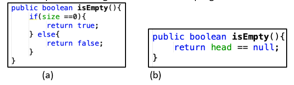  
Jawaban : Jika yang a akan mengecek size atau ukuran datanya sama dengan 0 maka akan bernilai true. Sedangkan yang b akan mengecek head nya bernilai null / kosong maka akan bernilai true.  

### 2.4 Tugas

1.	Buat program antrian vaksinasi menggunakan queue berbasis double linked list sesuai ilustrasi dan menu di bawah ini! (counter jumlah antrian tersisa di menu cetak(3) dan data orang yang telah divaksinasi di menu Hapus Data(2) harus ada)  
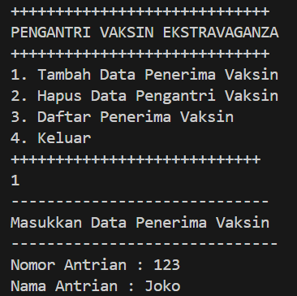  
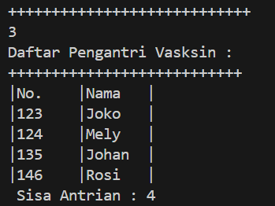  
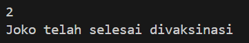  
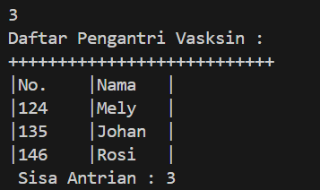  

2.	Buatlah program daftar film yang terdiri dari id, judul dan rating menggunakan double linked lists, bentuk program memiliki fitur pencarian melalui ID Film dan pengurutan Rating secara descending. Class Film wajib diimplementasikan dalam soal ini.  
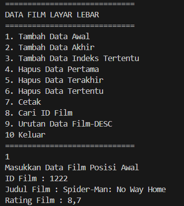  
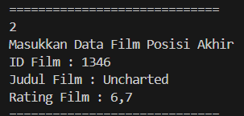  
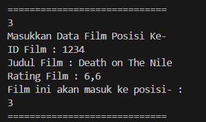  
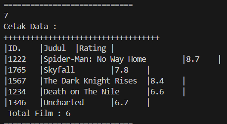  
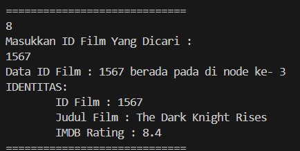  
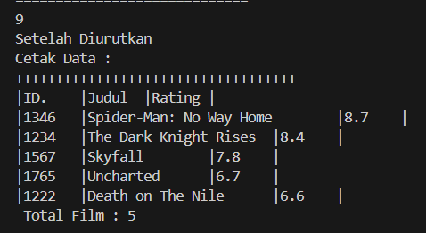  

