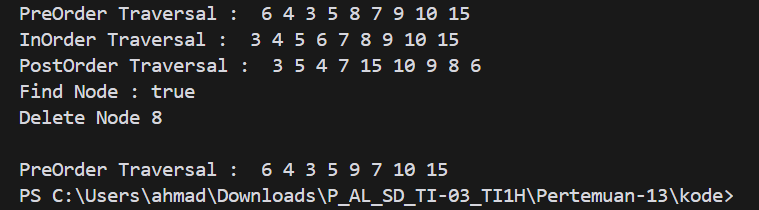
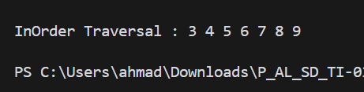
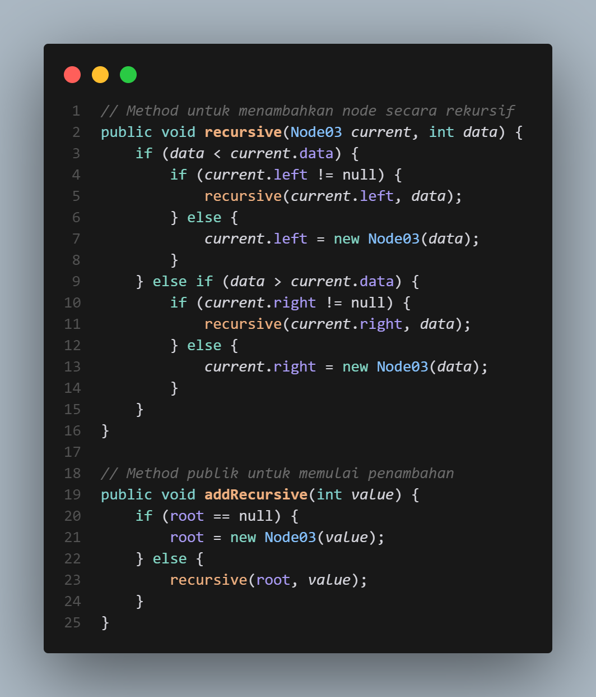
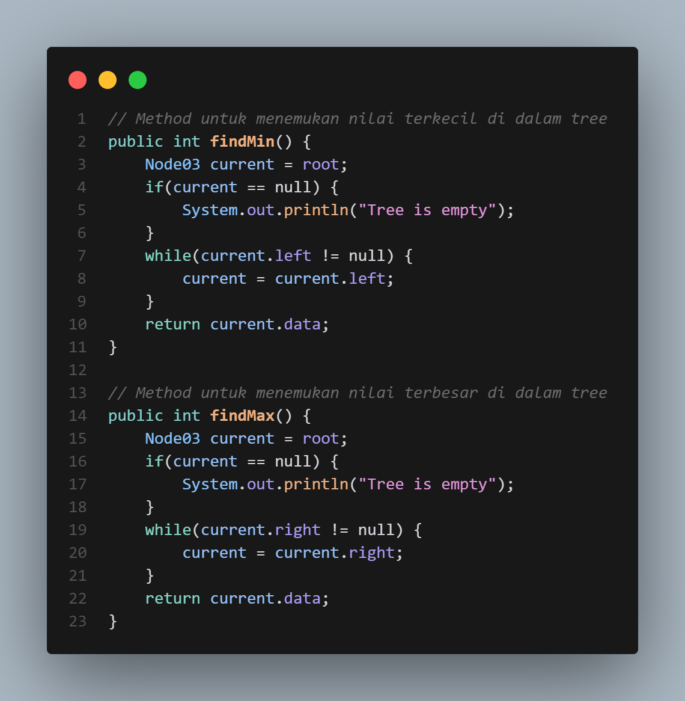
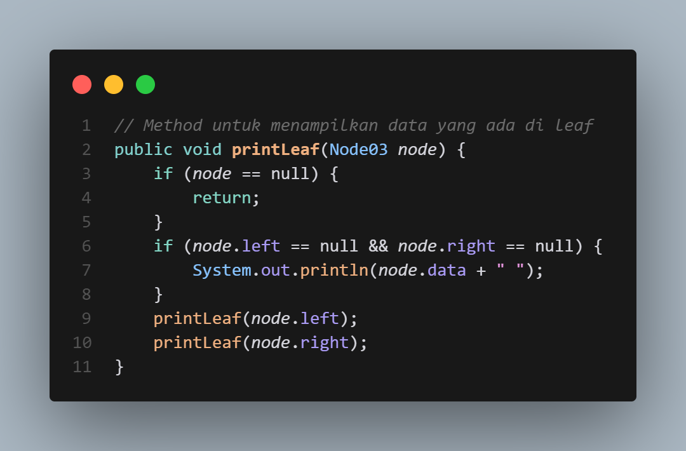
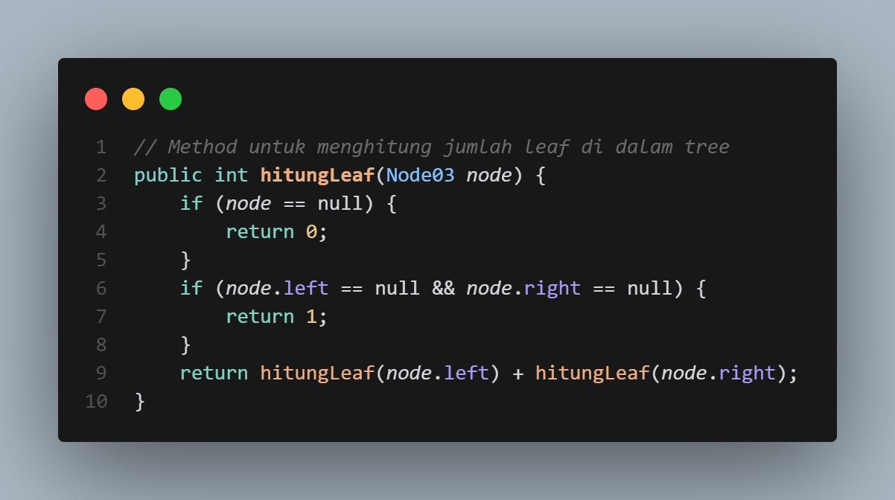
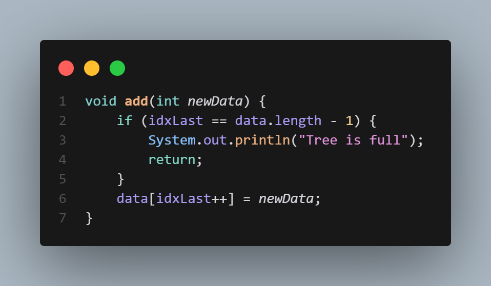
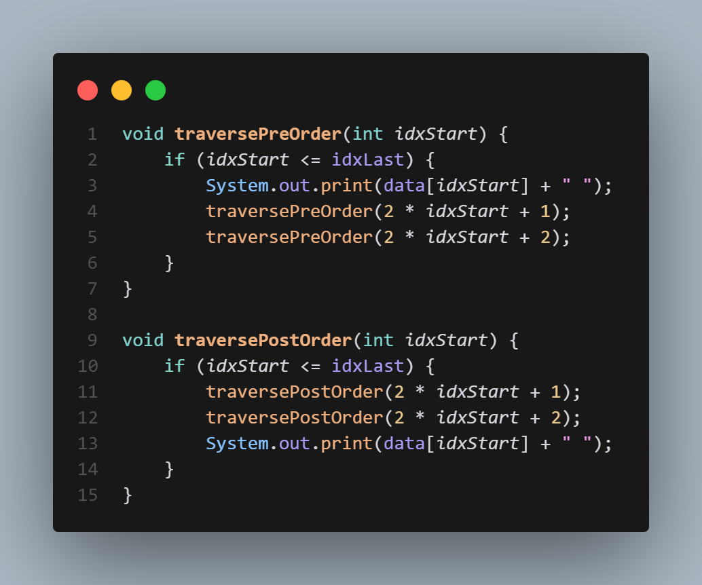

# Pertemuan 13 Praktikum Algoritma dan Struktur Data
  

Nama : AHMAD DZUL FADHLI HANNAN  
Nomor : 03  
Kelas : TI1H  
NIM : 2341720106

## 1. Tujuan Praktikum
Setelah melakukan praktikum ini, mahasiswa mampu:
1.	memahami model Tree khususnya Binary Tree
2.	membuat dan mendeklarasikan struktur algoritma Binary Tree.
3.	menerapkan dan mengimplementasikan algoritma Binary Tree dalam kasus Binary Search Tree

## 2. Praktikum
### 2.1 Percobaan 1
#### 2.1.1 Langkah-langkah
#### 2.1.2 Verifikasi Hasil Percobaan  
Data Ditemukan  
  

#### 2.1.3 Pertanyaan
1.	Mengapa dalam binary search tree proses pencarian data bisa lebih efektif dilakukan dibanding binary tree biasa?  
Jawaban : Binary search tree (BST) memungkinkan pencarian data yang lebih efisien karena setiap node kiri memiliki nilai yang lebih kecil dan setiap node kanan memiliki nilai yang lebih besar dari node induknya. Ini memfasilitasi eliminasi cepat setengah bagian pohon pada setiap langkah pencarian, mengurangi jumlah perbandingan yang diperlukan dibandingkan dengan binary tree biasa yang tidak terstruktur secara terurut.

2.	Untuk apakah di class Node, kegunaan dari atribut left dan right?  
Jawaban: Atribut left dan right di class Node berfungsi untuk menunjuk ke node anak kiri dan anak kanan dari node tersebut, membantu dalam pembentukan struktur pohon biner.

3.	a. Untuk apakah kegunaan dari atribut root di dalam class BinaryTree?  
    Jawaban: Atribut root di class BinaryTree berperan sebagai pointer ke node utama atau node paling atas, yang merupakan titik awal dari struktur pohon biner.
b. Ketika objek tree pertama kali dibuat, apakah nilai dari root?    
    Jawaban: Saat objek tree baru dibuat, nilai dari root adalah null, menandakan bahwa pohon tersebut masih kosong tanpa node.

4.	Ketika tree masih kosong, dan akan ditambahkan sebuah node baru, proses apa yang akan terjadi?  
Jawaban : Jika tree masih kosong dan node baru ditambahkan, node tersebut akan diatur sebagai root dari tree, menjadi titik awal dari struktur pohon.

5.	Perhatikan method add(), di dalamnya terdapat baris program seperti di bawah ini. Jelaskan secara detil untuk apa baris program tersebut?  
if(data<current.data){  
if(current.left!=null){ current = current.left;  
}else{  
current.left = new Node(data); break;  
}  
}  
Jawaban : Kode ini digunakan untuk menambahkan data ke dalam binary search tree. Jika data yang akan ditambahkan lebih kecil dari data pada node saat ini (current), program akan memeriksa apakah node anak kiri dari node saat ini sudah ada. Jika belum, data baru akan dibuat sebagai node anak kiri dari node saat ini. Jika sudah ada, pencarian akan berlanjut ke node anak kiri tersebut.  

### 2.2 Percobaan 2  
#### 2.2.1 Langkah-langkah  
#### 2.2.2 Verifikasi Hasil Percobaan  
  

#### 2.2.3 Pertanyaan  
1.	Apakah kegunaan dari atribut data dan idxLast yang ada di class BinaryTreeArray?  
Jawaban : Atribut data dalam class BinaryTreeArray digunakan untuk menyimpan elemen-elemen dari pohon biner dalam bentuk array. Sedangkan idxLast digunakan untuk menunjukkan indeks terakhir dari elemen yang terisi dalam array tersebut, yang membantu dalam mengetahui jumlah elemen atau node yang telah ditambahkan ke dalam pohon.  
2.	Apakah kegunaan dari method populateData()?  
Jawaban : Method populateData() digunakan untuk menginisialisasi array data dan indeks terakhir (idxLast) pada class BinaryTreeArray. Method ini mengambil array data dan nilai idxLast sebagai parameter, kemudian menetapkan array tersebut ke variabel data dan nilai idxLast ke variabel idxLast dalam class.  
3.	Apakah kegunaan dari method traverseInOrder()?  
Jawaban : Method traverseInOrder() digunakan untuk menampilkan / print elemen-elemen dari binary tree dalam bentuk array dalam urutan inOrder (kiri, root, kanan). Method ini menggunakan rekursi untuk mengecek setiap node dan menampilkan elemen-elemen dalam bentuk inOrder.  
4.	Jika suatu node binary tree disimpan dalam array indeks 2, maka di indeks berapakah posisi left child dan right child masing-masing?  
Jawaban : Untuk node yang disimpan di indeks 2, left child akan berada di indeks 2*2+1 = 5, dan right child akan berada di indeks 2*2 + 2 = 6.  
5.	Apa kegunaan statement int idxLast = 6 pada praktikum 2 percobaan nomor 4?  
Jawaban : Statement int idxLast = 6 menetapkan nilai idxLast menjadi 6, yang menunjukkan bahwa elemen atau node terakhir yang ditambahkan ke dalam array berada pada indeks 6.  

### 2.3 Tugas
1.	Buat method di dalam class BinaryTree yang akan menambahkan node dengan cara rekursif.  
  

2.	Buat method di dalam class BinaryTree untuk menampilkan nilai paling kecil dan yang paling besar yang ada di dalam tree.  
  

3.	Buat method di dalam class BinaryTree untuk menampilkan data yang ada di leaf.  
  

4.	Buat method di dalam class BinaryTree untuk menampilkan berapa jumlah leaf yang ada di dalam tree.  
  

5.	Modifikasi class BinaryTreeArray, dan tambahkan :  
•	method add(int data) untuk memasukan data ke dalam tree  
  

•	method traversePreOrder() dan traversePostOrder()  
  

