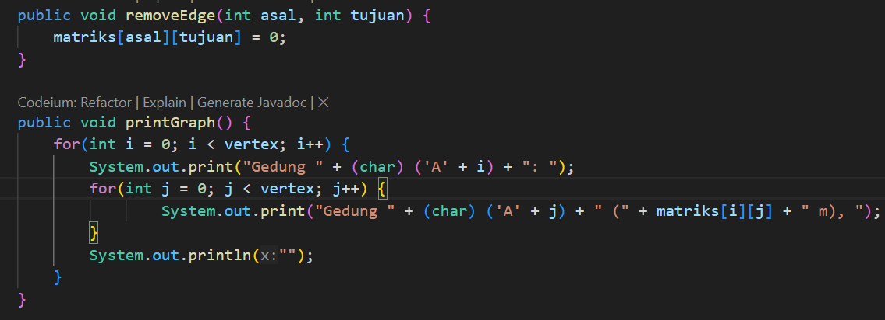
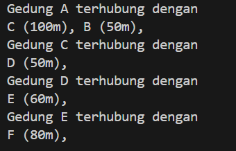

# Pertemuan 14 Praktikum Algoritma dan Struktur Data
  

Nama : AHMAD DZUL FADHLI HANNAN  
Nomor : 03  
Kelas : TI1H  
NIM : 2341720106

## 1. Tujuan Praktikum
Setelah melakukan praktikum ini, mahasiswa mampu:  
1.	memahami model graph  
2.	membuat dan mendeklarasikan struktur algoritma graph  
3.	menerapkan algoritma dasar graph dalam beberapa studi kasus  

## 2. Praktikum
### 2.1 Percobaan 1
#### 2.1.1 Langkah-langkah
#### 2.1.2 Verifikasi Hasil Percobaan  
  

#### 2.1.3 Pertanyaan
1.	Perbaiki kode program Anda apabila terdapat error atau hasil kompilasi kode tidak sesuai!  
2.	Pada class Graph, terdapat atribut list[] bertipe DoubleLinkedList. Sebutkan tujuan pembuatan variabel tersebut!  
Jawaban : Digunakan untuk menyimpan informasi tentang hubungan antara setiap titik (vertex) dalam grafik.  
3.	Jelaskan alur kerja dari method removeEdge!  
Jawaban : 
- Metode removeEdge menerima dua parameter asal dan tujuan, yang merupakan indeks dari titik-titik yang terhubung dalam grafik.  
- Pada setiap iterasi, metode ini memeriksa apakah indeks saat ini sama dengan tujuan.  
- Jika indeks saat ini sama dengan tujuan, maka metode ini memanggil metode remove pada DoubleLinkedList yang terletak pada indeks asal untuk menghapus tujuan dari DoubleLinkedList tersebut.        
4.	Apakah alasan pemanggilan method addFirst() untuk menambahkan data, bukan method add jenis lain saat digunakan pada method addEdge pada class Graph?  
Jawaban : Untuk memastikan bahwa hubungan tersebut akan menjadi titik pertama dalam DoubleLinkedList tersebut.  
5.	Modifikasi kode program sehingga dapat dilakukan pengecekan apakah terdapat jalur antara suatu node dengan node lainnya, seperti contoh berikut (Anda dapat memanfaatkan Scanner).  
  
Jawaban :  
  
  
  

### 2.2 Percobaan 2  
#### 2.2.1 Langkah-langkah  
#### 2.2.2 Verifikasi Hasil Percobaan  
  

#### 2.2.3 Pertanyaan  
1.	Perbaiki kode program Anda apabila terdapat error atau hasil kompilasi kode tidak sesuai!  
Jawaban :  
  
2.	Apa jenis graph yang digunakan pada Percobaan 2?  
Jawaban : Directed graph  
3.	Apa maksud dari dua baris kode berikut?  
  

Jawaban : Digunakan untuk menambahkan edge dari node B ke node C berjarak 70 meter, dan edge dari C ke B berjarak 80 meter;  

4.	Modifikasi kode program sehingga terdapat method untuk menghitung degree, termasuk inDegree dan outDegree!  
Jawaban :  
  
  

### 2.3 Tugas
1.	Modifikasi kode program pada class GraphMain sehingga terdapat menu program yang bersifat dinamis, setidaknya terdiri dari:  
a)	Add Edge  
b)	Remove Edge  
c)	Degree  
d)	Print Graph  
e)	Cek Edge  
Pengguna dapat memilih menu program melalui input Scanner  
2.	Tambahkan method updateJarak pada Percobaan 1 yang digunakan untuk mengubah jarak antara dua node asal dan tujuan!  
3.	Tambahkan method hitungEdge untuk menghitung banyaknya edge yang terdapat di dalam graf!  

Jawaban :   
1.  
Menu  
  
  
Add Edge  

Degree    
  
Print Graph  
  
Remove Edge  
  
  
Cek Edge  
  
  
2. Update Jarak  
Class Graph  
  
Class DoubleLinkedList  
  
  
  
3. Hitung Edge  
  
  